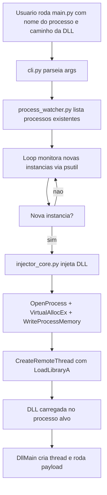
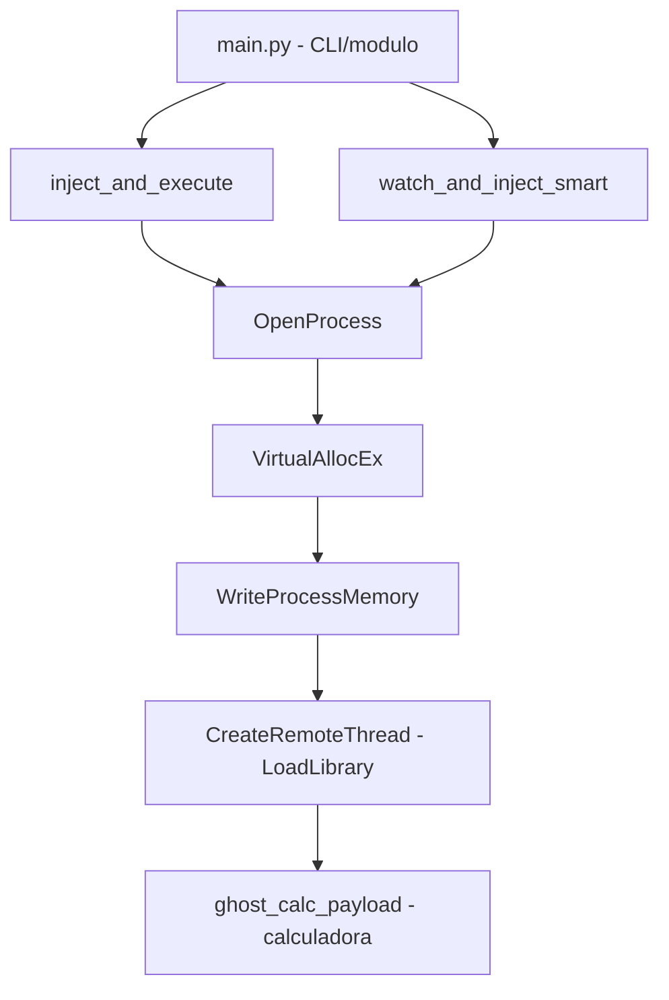

# 👻 PhantomDLL-Injector
<p align="center">
  
  <a href="https://github.com/panda12332145/PhantomDLL-Injector/commits/main"></a>
  <a href="https://github.com/panda12332145/PhantomDLL-Injector"></a>
  
</p>
---
## ⚠️ Aviso Legal / Uso Educacional

> Projeto de **estudo de engenharia reversa e defesa do Windows** — técnicas de injeção de DLL explicadas para **laboratórios próprios e autorizados** (malware analysis, hardening de EDR). Usar contra sistemas sem permissão é **crime** (Lei 12.737/2012). Os payloads incluídos (`ghost_calc_payload_*`) apenas abrem a calculadora, sem carga maliciosa.

---
## 🔖 Resumo

Ferramenta em Python para **estudo de injeção de DLL** no Windows, explorando a API clássica `OpenProcess → VirtualAllocEx → WriteProcessMemory → CreateRemoteThread` — com modos smart (watch & inject), payloads-DLL de exemplo inofensivos (calculadora) e documentação de arquitetura, segurança e limitações.

### ✨ Funcionalidades Principais

- ✅ Injeção via `inject_and_execute` (fluxo clássico de 4 passos)
- ✅ Modo `watch_and_inject_smart` — detecta processo-alvo e injeta
- ✅ DLLs payload x86/x64 de exemplo (abrem a calculadora)
- ✅ Uso via CLI (`main.py`) ou como módulo Python
- ✅ Documentação extra: ARCHITECTURE.md, SECURITY.md, usage_examples.md

## 📽 Demonstração

```text
$ python main.py -h
# injeção direta por PID, monitoramento smart, dlls ghost_calc

$ python main.py --watch explorer.exe
[+] Alvo detectado, injetando ghost_calc_payload_x64.dll...
[+] Calculadora aberta no processo alvo (sucesso didático)
```

## ⚙️ Explicação das Partes Importantes

### `inject_and_execute` — fluxo de injeção

```python
# 1. OpenProcess          → abre handle no processo alvo
# 2. VirtualAllocEx       → aloca memória no processo remoto
# 3. WriteProcessMemory   → escreve o caminho da DLL
# 4. CreateRemoteThread   → carrega a DLL (LoadLibrary)
```

> O clássico 'DLL injection' de 4 passos — cada etapa comentada no código e explicada em ARCHITECTURE.md.

### `watch_and_inject_smart`

```python
# monitora a criação de processos e dispara a injeção
# assim que o processo-alvo aparece
```

> Modo proativo: vigia e injeta automaticamente — útil para demonstrar detecção (EDR observa CreateRemoteThread).

### Payloads (`ghost_calc_payload_*.dll`)

```c
// ghost_calc_loader.c — DLL mínima que apenas
// chama ShellExecute na calculadora ao ser carregada
```

> Payloads propositadamente inofensivos: provam o controle sem fazer nada malicioso.

###Arquitetura



Fluxo real: entrada (processo + dll + intervalo) -> processamento (psutil + ctypes) -> dependencias (kernel32.dll do Windows) -> saida (log no console e DLL injetada).

---

####via main.py

```bash
python main.py notepad.exe C:\caminho\absoluto\para\bin\ghost_calc_payload_x64.dll --interval 3
```

Args:

- `process`: nome do exe pra monitorar, ex: notepad.exe
- `dll`: caminho completo da DLL
- `--interval`: segundos entre verificacoes, default 3

O script lista processos existentes e diz que nao vai injetar neles. Depois fica esperando instancia nova. Quando aparece, injeta e loga.

Pra parar, Ctrl+C.

---

####como modulo

```python
from src.phantom_dll_injector import watch_and_inject_smart

watch_and_inject_smart("notepad.exe", "C:\\full\\path\\ghost_calc_payload_x64.dll", 3)
```

---

####injecao direta por PID

```python
from src.phantom_dll_injector import inject_and_execute

inject_and_execute(1234, "C:\\full\\path\\ghost_calc_payload_x64.dll")
```

---

###Explicacao das partes importantes

---

####`inject_and_execute`

```python
def inject_and_execute(pid: int, dll_path: str) -> bool:
    h_process = OpenProcess(PROCESS_ALL_ACCESS, False, pid)
    remote_mem = VirtualAllocEx(...)
    WriteProcessMemory(...)
    load_lib_addr = GetProcAddress(GetModuleHandleA(b'kernel32.dll'), b'LoadLibraryA')
    h_thread = CreateRemoteThread(h_process, None, 0, load_lib_addr, remote_mem, 0, None)
```

Abre o processo, aloca memoria la dentro, escreve o caminho da DLL, pega endereco do LoadLibraryA e cria thread remota pra carregar. Espera 3s e retorna True se deu certo.

---

####`watch_and_inject_smart`

```python
def watch_and_inject_smart(process_name: str, dll_path: str, check_interval: int = 5):
    known_processes = {}
    # guarda PIDs existentes pra nao injetar
    # loop com psutil.process_iter, detecta PID novo, sleep 0.5s, injeta
```

Evita injetar duas vezes no mesmo processo e limpa PIDs que morreram.

---

####`ghost_calc_loader.c`

```c
BOOL APIENTRY DllMain(HMODULE hModule, DWORD ul_reason_for_call, LPVOID lpReserved) {
    case DLL_PROCESS_ATTACH:
        CreateThread(NULL, 0, ExecutePayload, NULL, 0, NULL);
}
```

DllMain nao executa payload direto, cria thread separada. Isso evita deadlock no loader lock. Payload so da WinExec calc.exe, exemplo simples.

---

###Consideracoes de seguranca

- abre processo com PROCESS_ALL_ACCESS, permissao maxima. Melhor seria usar so as flags necessarias: CREATE_THREAD, VM_OPERATION, VM_WRITE, QUERY_INFORMATION
- nao valida se arquivo DLL existe antes de injetar, nem checa assinatura. Se o caminho vier de input externo, pode injetar coisa errada
- tratamento de excecao generico com `except:` esconde erro, dificulta saber porque falhou
- WinExec e API antiga, pode ser detectada por antivirus, mas aqui e so exemplo
- binarios .dll versionados no repo dificultam auditoria. Ideal seria compilar em release, nao versionar binario direto
- precisa rodar com privilegio suficiente. Se tentar injetar em processo protegido ou de outro usuario, vai falhar
- nao tem segredo hardcoded, verificado nos .py e .c
- uso restrito a ambiente de teste controlado, nunca em maquina de terceiros sem permissao

Veja `docs/SECURITY.md` pra analise mais detalhada.

## 🔄 Fluxo de Trabalho / Arquitetura



## 📂 Estrutura do Projeto

```plaintext
PhantomDLL-Injector/
├── main.py                    # CLI de entrada
├── ghost_calc_payload_x64.dll # Payload didático 64-bit
├── ghost_calc_payload_x86.dll # Payload didático 32-bit
├── test_imports.py            # Smoke test
├── ARCHITECTURE.md            # Arquitetura detalhada
├── SECURITY.md                # Notas de segurança
├── usage_examples.md          # Exemplos de uso
├── requirements.txt
└── README.md
```

## 🛠️ Tecnologias

| Ferramenta | Uso |
|---|---|
| **Python 3** | Orquestração (ctypes/WinAPI) |
| **Win32 API** | OpenProcess, VirtualAllocEx, WriteProcessMemory, CreateRemoteThread |
| **C (MinGW)** | Compilação das DLLs payload |
| **Windows** | Alvo da ferramenta |

## ▶️ Instalação

```bash
git clone https://github.com/panda12332145/PhantomDLL-Injector.git
cd PhantomDLL-Injector
pip install -r requirements.txt
# Windows apenas
```

## 🚀 Execução

```bash
python main.py --help
# via CLI, como módulo, ou injeção direta por PID
# (ver usage_examples.md)
python test_imports.py
```

## 🧪 Testes

`python test_imports.py` — smoke test de importações e dependências.

## ⚠️ Limitações

- Windows apenas (WinAPI)
- Exige privilégios suficientes no processo-alvo
- Defensores (EDR) detectam o padrão clássico — é exatamente o ponto do estudo

## 🚀 Roadmap

- [ ] Modo sem thread remota (alternative techniques)
- [ ] Compilação reproduzível das DLLs
- [ ] Detecções correspondentes (blue team)

## 📄 Licença

Todos os direitos reservados ao autor.

---

## 👾 Autor

<p align="center">
  
</p>

<p align="center">Feito por <strong>Panda12332145</strong> 👋🏽</p>

---

## 🧑‍💻 Sobre Mim

Sou apaixonado por **Física Teórica, Cibersegurança e Desenvolvimento de Sistemas**. Tenho grande interesse em programação de baixo nível, engenharia reversa, automação, sistemas Windows, criptografia e segurança ofensiva. Também gosto bastante de música, filosofia e computação avançada.

---

## 🌐 Redes

* **Site:** [https://panda-h0me.netlify.app/](https://panda-h0me.netlify.app/)
* **YouTube:** [https://www.youtube.com/@X86BinaryGhost](https://www.youtube.com/@X86BinaryGhost)
* **Instagram:** [https://www.instagram.com/01pandal10/](https://www.instagram.com/01pandal10/)
* **GitHub:** [https://github.com/panda12332145](https://github.com/panda12332145)
* **LinkedIn:** [linkedin.com/in/athos-da-boanergis](https://www.linkedin.com/in/athos-d%C3%A3-boanergis-5585a4288/)

---

## 🚀 Áreas de Interesse

* **Cibersegurança Avançada** 🔒
* **Hacking & Engenharia Reversa** 💻
* **Computação de Baixo Nível** 🖥️
* **Matemática e Física Teórica** 📐⚛️
* **Desenvolvimento de Ferramentas de Segurança** 🛠️

_"Conhecimento é poder, e domínio técnico vem da compreensão profunda dos sistemas."_

---

## 📞 Contato & Suporte

Para colaborações, dúvidas ou sugestões:

📧 **E-mail:** [athos.cybersec@gmail.com](mailto:athos.cybersec@gmail.com)

🐛 **Reportar Bug:** [Abrir Issue](https://github.com/panda12332145/PhantomDLL-Injector/issues)

💡 **Sugerir Melhoria:** [Discussions](https://github.com/panda12332145/PhantomDLL-Injector/discussions)
