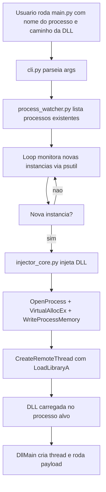

# PhantomDLL Injector

Ferramenta simples em Python pra monitorar processos no Windows e injetar DLL automaticamente quando uma nova instancia aparece. Vem com um payload de exemplo em C que abre a calculadora, so pra testar o fluxo de injecao.

Nao e framework, nao e servico, e um script CLI direto ao ponto.

## Funcionalidades

- monitora processos pelo nome usando psutil
- ignora processos que ja existiam antes de iniciar, injeta so em instancias novas
- injeta DLL via WinAPI: OpenProcess, VirtualAllocEx, WriteProcessMemory, CreateRemoteThread com LoadLibraryA
- CLI com argparse: nome do processo, caminho da DLL e intervalo de verificacao
- payload de exemplo em C com DllMain que cria thread separada e executa calc.exe
- binarios de exemplo 32 e 64 bits compilados a partir do C

## Tecnologias

- Python 3 com ctypes e psutil
- C com Windows API (windows.h)
- WinAPI kernel32: OpenProcess, VirtualAllocEx, WriteProcessMemory, GetModuleHandleA, GetProcAddress, CreateRemoteThread, WaitForSingleObject, CloseHandle

## Arquitetura



Fluxo real: entrada (processo + dll + intervalo) -> processamento (psutil + ctypes) -> dependencias (kernel32.dll do Windows) -> saida (log no console e DLL injetada).

## Estrutura do projeto

```
PhantomDLL-Injector/
|-- main.py
|-- requirements.txt
|-- .gitignore
|-- bin/
|   |-- ghost_calc_payload_x86.dll
|   |-- ghost_calc_payload_x64.dll
|   `-- README.md
|-- src/
|   |-- phantom_dll_injector/
|   |   |-- __init__.py
|   |   |-- win_api.py
|   |   |-- injector_core.py
|   |   |-- process_watcher.py
|   |   `-- cli.py
|   `-- payload/
|       |-- ghost_calc_loader.c
|       `-- build_instructions.md
|-- docs/
|   |-- ARCHITECTURE.md
|   `-- SECURITY.md
|-- examples/
|   `-- usage_examples.md
`-- tests/
    `-- test_imports.py
```

## Instalacao

So funciona no Windows, por causa do kernel32.

```bash
git clone https://github.com/panda12332145/PhantomDLL-Injector.git
cd PhantomDLL-Injector
pip install -r requirements.txt
```

Dependencia unica: psutil. ctypes ja vem no Python.

Se quiser recompilar a DLL de exemplo, precisa de gcc (MinGW) ou Visual Studio no Windows. Veja `src/payload/build_instructions.md`.

## Execucao

### via main.py

```bash
python main.py notepad.exe C:\caminho\absoluto\para\bin\ghost_calc_payload_x64.dll --interval 3
```

Args:

- `process`: nome do exe pra monitorar, ex: notepad.exe
- `dll`: caminho completo da DLL
- `--interval`: segundos entre verificacoes, default 3

O script lista processos existentes e diz que nao vai injetar neles. Depois fica esperando instancia nova. Quando aparece, injeta e loga.

Pra parar, Ctrl+C.

### como modulo

```python
from src.phantom_dll_injector import watch_and_inject_smart

watch_and_inject_smart("notepad.exe", "C:\\full\\path\\ghost_calc_payload_x64.dll", 3)
```

### injecao direta por PID

```python
from src.phantom_dll_injector import inject_and_execute

inject_and_execute(1234, "C:\\full\\path\\ghost_calc_payload_x64.dll")
```

## Explicacao das partes importantes

### `inject_and_execute`

```python
def inject_and_execute(pid: int, dll_path: str) -> bool:
    h_process = OpenProcess(PROCESS_ALL_ACCESS, False, pid)
    remote_mem = VirtualAllocEx(...)
    WriteProcessMemory(...)
    load_lib_addr = GetProcAddress(GetModuleHandleA(b'kernel32.dll'), b'LoadLibraryA')
    h_thread = CreateRemoteThread(h_process, None, 0, load_lib_addr, remote_mem, 0, None)
```

Abre o processo, aloca memoria la dentro, escreve o caminho da DLL, pega endereco do LoadLibraryA e cria thread remota pra carregar. Espera 3s e retorna True se deu certo.

### `watch_and_inject_smart`

```python
def watch_and_inject_smart(process_name: str, dll_path: str, check_interval: int = 5):
    known_processes = {}
    # guarda PIDs existentes pra nao injetar
    # loop com psutil.process_iter, detecta PID novo, sleep 0.5s, injeta
```

Evita injetar duas vezes no mesmo processo e limpa PIDs que morreram.

### `ghost_calc_loader.c`

```c
BOOL APIENTRY DllMain(HMODULE hModule, DWORD ul_reason_for_call, LPVOID lpReserved) {
    case DLL_PROCESS_ATTACH:
        CreateThread(NULL, 0, ExecutePayload, NULL, 0, NULL);
}
```

DllMain nao executa payload direto, cria thread separada. Isso evita deadlock no loader lock. Payload so da WinExec calc.exe, exemplo simples.

## Testes

Nao tem suite completa, so validacao estatica.

```bash
python -m py_compile src/phantom_dll_injector/*.py main.py
python tests/test_imports.py
```

No Windows, teste real seria abrir notepad e injetar a DLL de teste.

## Consideracoes de seguranca

- abre processo com PROCESS_ALL_ACCESS, permissao maxima. Melhor seria usar so as flags necessarias: CREATE_THREAD, VM_OPERATION, VM_WRITE, QUERY_INFORMATION
- nao valida se arquivo DLL existe antes de injetar, nem checa assinatura. Se o caminho vier de input externo, pode injetar coisa errada
- tratamento de excecao generico com `except:` esconde erro, dificulta saber porque falhou
- WinExec e API antiga, pode ser detectada por antivirus, mas aqui e so exemplo
- binarios .dll versionados no repo dificultam auditoria. Ideal seria compilar em release, nao versionar binario direto
- precisa rodar com privilegio suficiente. Se tentar injetar em processo protegido ou de outro usuario, vai falhar
- nao tem segredo hardcoded, verificado nos .py e .c
- uso restrito a ambiente de teste controlado, nunca em maquina de terceiros sem permissao

Veja `docs/SECURITY.md` pra analise mais detalhada.

## Limitacoes

- so Windows
- arquitetura da DLL tem que bater com a do processo alvo, 32 bits nao injeta em 64 bits e vice versa
- precisa privilegio de debug ou admin dependendo do alvo
- nao funciona em processos protegidos (PPL, anticheat)
- sem log em arquivo, so console
- sem validacao de integridade da DLL

## Roadmap

Implementado:

- monitor de novas instancias
- injecao via CreateRemoteThread + LoadLibraryA
- payload de exemplo em C
- CLI simples

Planejado (nao implementado, so ideias):

- validacao de existencia e arquitetura da DLL antes de injetar
- usar permissoes minimas em vez de PROCESS_ALL_ACCESS
- opcao de log em arquivo
- suporte a injecao via NtCreateThreadEx ou outras tecnicas pra teste
- remover binarios do repo e gerar em CI
- testes automatizados no Windows

## Licenca

Repositorio original nao tinha arquivo LICENSE. Sem licenca definida, considera uso privado. Se for publicar, adicione uma licenca.

## Autor

Repositorio original em github.com/panda12332145/PhantomDLL-Injector. Refatoracao estrutural feita pra organizar modulos, renomear arquivos e documentar.
